# 🎯 求职雷达 · Job Radar

> **🚀 5 分钟筛 300 个 Boss 岗位 — AI 帮你锁定真·神仙工作**
>
> 把简历喂给它,一键扫遍 Boss,**S/A 级岗位自动浮到顶**,带评分理由 + HR 活跃度 + 招呼语建议 — 投了就有回音。
>
> ✅ **零封号风险**:不爬接口,只观察浏览器自家返回 · ✅ **本地运行**:数据不出你电脑 · ✅ **用你自己的 AI key**:扫 100 个岗位 < ¥1

  

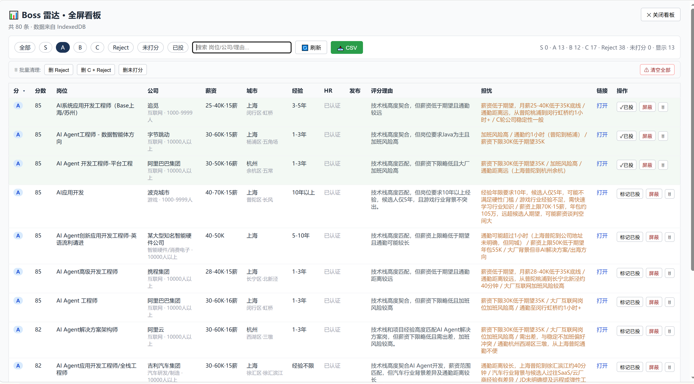

---

## 😤 投简历投到怀疑人生?

你是不是这样:

- 🥲 每天 Boss 刷 300 个岗位,2-3 小时刷到眼瞎,投出去 80% 已读不回
- 🥲 标题写"AI 算法工程师",JD 一看是 Python 后端 — 浪费 5 分钟
- 🥲 投了三天发现 HR 三周前就最后一次活跃,等于投了个寂寞
- 🥲 「想去大厂、不加班、通勤近、技术栈对口」— 你脑子里这些要求,没工具帮你算

**根因**:Boss 不会按"是否适合你"排序,它按平台利益排。你要的是个**只为你服务**的筛选器。

## ✨ 求职雷达就是这个筛选器

你把简历 + 6 维偏好(薪资 / 大厂 / 不加班 / 稳定 / 通勤 / 技术栈)告诉它一次,**它替你扫整个 Boss**:

| 你之前 | 用了求职雷达 |
|---|---|
| 人肉刷 300 个 = 2-3 小时 | AI 评分排序 = **5 分钟** |
| 标题党踩坑 | LLM 看完整 JD 判定,**带"与简历偏离"扣分** |
| 投死岗白搭 | **HR 活跃度颜色标识** — 投绿色,跳过橘色 |
| Excel 手动统计 | **一键导 CSV**,二次筛(按 HR 活跃 + 分数倒序) |
| 大厂 vs 创业公司纠结 | **稳定/大厂/不加班** 3 维星级权重,LLM 自动算 |
| 投递杳无音讯 | 每条带 **AI 写的招呼语** — 直接复制粘贴 |

---

## ✨ 功能亮点

| | |
|---|---|
| 🛡 **零接口爬取** | 注入主世界 monkey-patch `fetch`/XHR,**只观察** Boss 自家 JS 返回的 `/joblist.json` + `/job/detail.json`,自己不发请求 — 风控几乎拿你没办法 |
| 🤖 **7 个 AI 模型可选** | DeepSeek / 通义 / 豆包 / MiniMax / 智谱 / OpenAI / Claude — 用你自己的 API key |
| 🎯 **多维度打分** | 不是简单关键词匹配。简历 + 7 维星级权重(薪资/大厂/不加班/稳定/通勤/技术栈契合 + 住址)综合打 S→A→B→C→Reject 5 档 |
| ⚡ **可靠性** | MV3 SW 死掉能自动续跑、IndexedDB 抗 race / 抗 quota、增量保存、指纹去重避免重打分 |
| 📊 **看板** | popup 卡片视图 / 表格视图 + **🖥 全屏看板**(独立 tab,排序/搜索/筛选)+ **📥 CSV 一键导出** |
| 📨 **可选微信推送** | WxPusher 集成,跑完推 S/A 级到微信。**纯 PC 党可不填,在看板查结果** |
| 🌐 **HR 活跃度** | 每条岗位带 HR 上次活跃时间 — 一眼看出"是死岗还是真招" |
| ⏰ **定时自动跑** | chrome.alarms 每天指定时间自动 fire,Chrome 开着就行 |

---

## 🚀 5 分钟跑起来

### 1. 装扩展

```bash
git clone https://github.com/CharmYue/job-radar.git
```

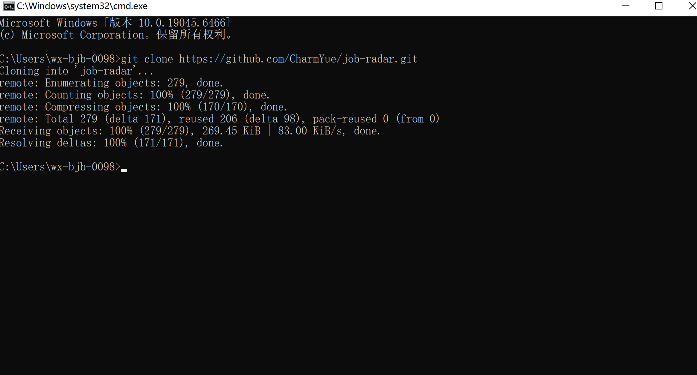

打开 `chrome://extensions/` → 右上角开**开发者模式** → 点**加载已解压的扩展程序** → 选 `extension/` 目录:

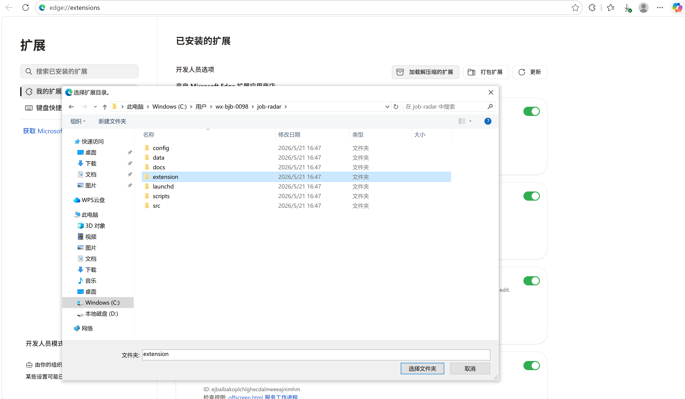

加载成功后扩展卡片显示版本号:

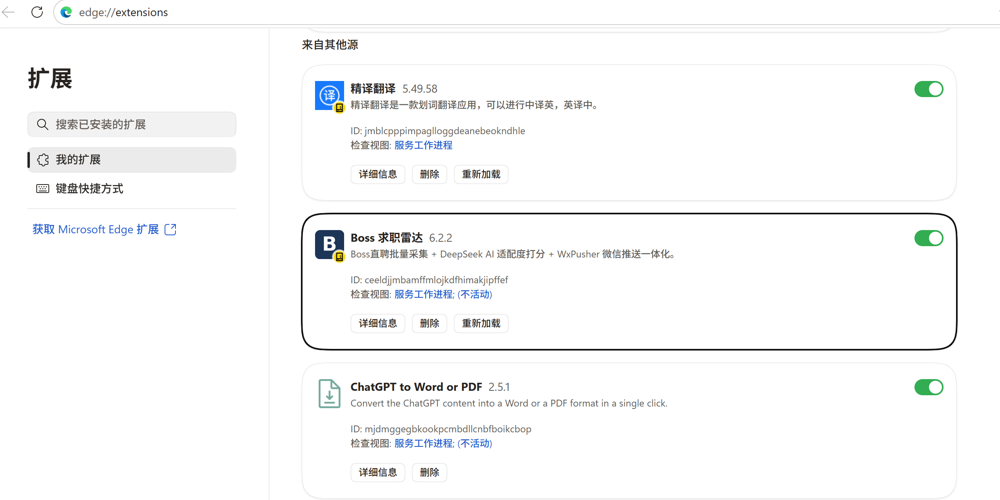

(看不到图标就在工具栏右边点拼图,把"Boss 求职雷达"钉住。)

### 2. 配画像 + AI key

点扩展图标 → **画像** tab:

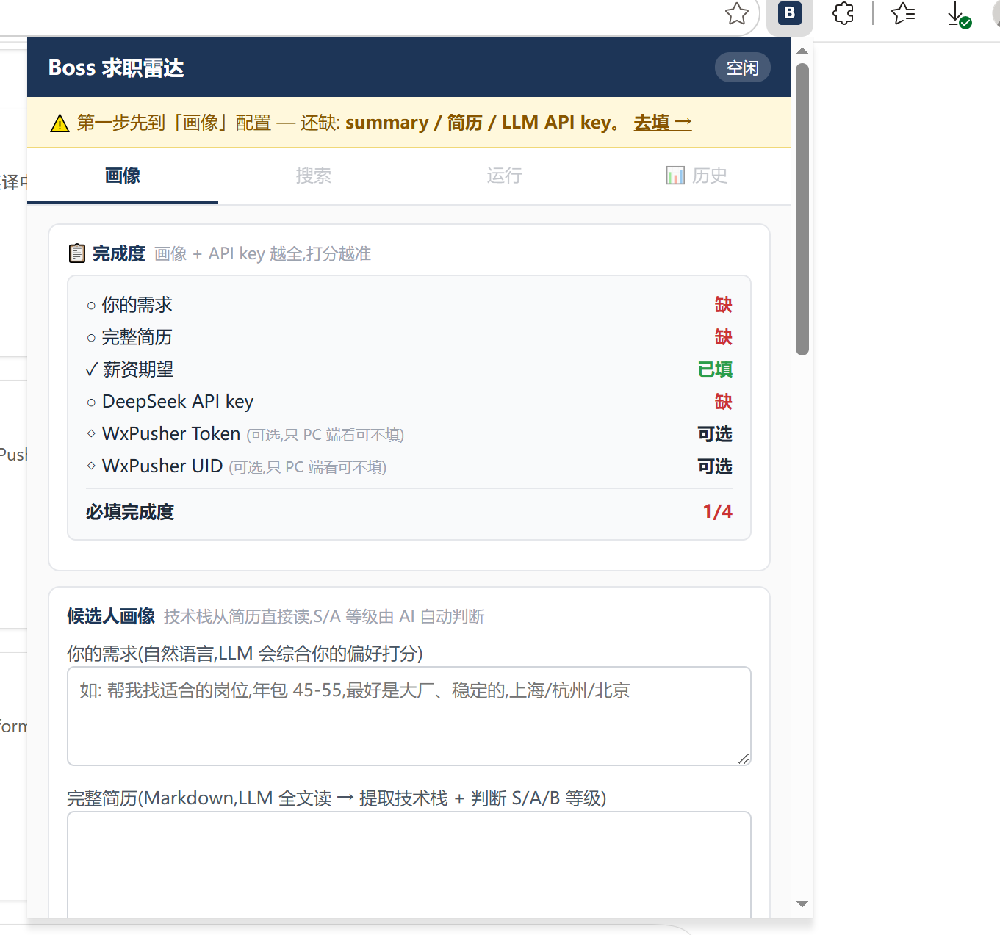

- **你的需求**:一句话,例 "找 AI 解决方案岗位,年包 45-55,大厂优先,稳定不加班"
- **完整简历**:粘贴你的 Markdown 简历(技术栈、年限、项目经验) — 不想自己写?点 **📋 填入演示画像** 一键加载样例
- **薪资期望**:拖滑块(月薪下限 / 上限 / 年包目标)
- **偏好权重**:6 维星级(薪资 / 大厂 / 不加班 / 稳定 / 通勤 / 技术栈契合)
- **AI 模型**:选 provider(推荐 DeepSeek,便宜快),填 API key,点 🧪 **测试模型连通**
- **WxPusher**(可选):想微信收推送就填,不填只用 PC 看

填完自动保存。

### 3. 在 Boss 上扫码登录

打开 `https://www.zhipin.com/`,正常扫码登录 — 扩展用你这个会话工作。

### 4. 配搜索

回扩展 → **搜索** tab:

- **关键词** chips:输入想搜的岗位(例 "AI 解决方案" / "Solution Engineer"),回车加 chip
- **城市**:勾上海/杭州/北京/...
- **每个关键词最多抓**:下拉选 约 30 / 60(推荐)/ 120 / 300
- **筛选**:经验 / 学历 / 发布时间(薪资建议留空,LLM 按你画像精确评)
- 点 ✓ **生成任务队列**

### 5. 跑一轮

切到 **运行** tab → 点 **🚀 跑一轮**。

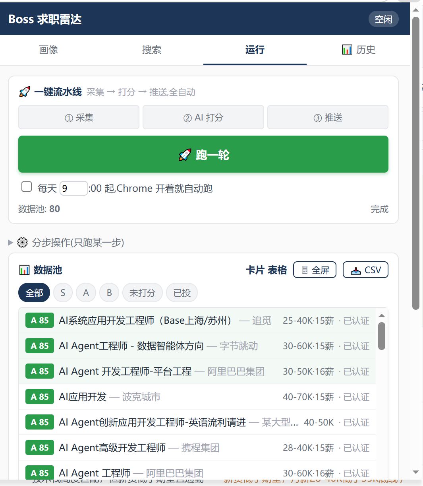

扩展会:
1. **采集**:打开 Boss 列表页(可最小化),滚动抓数据,每个任务之间用 alarm 接力(SW 死了自动续跑)
2. **打分**:LLM 并发 6 路给每个岗位评分,带理由 + 担忧 + 招呼语
3. **推送**(可选):WxPusher 拆 S 级和 A 级两次推送到微信

跑完点 **🖥 全屏** 看完整看板,按公司/分数/HR 活跃度排序,标记已投或屏蔽烂公司:

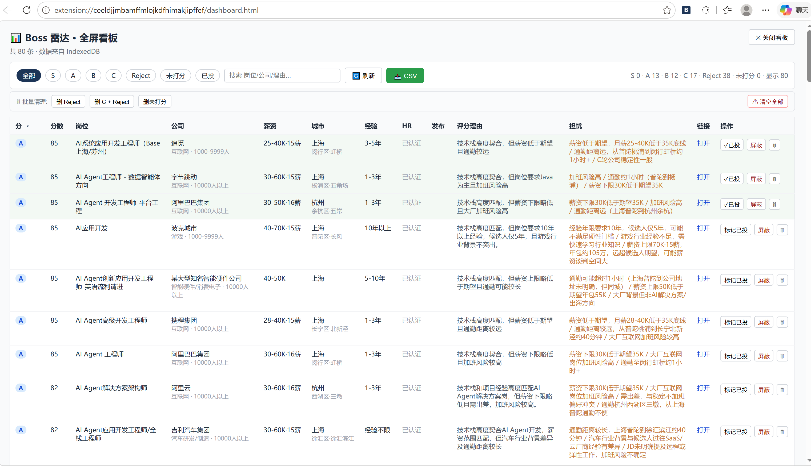

**📥 CSV** 一键导 Excel,二次筛(我自己的 SOP:HR 今日活跃 + A 级以上 + 不投朝阳区):

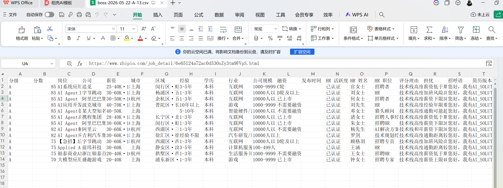

---

## 📱 手机随时刷岗位(可选 — WxPusher)

如果填了 WxPusher,跑完流水线会**自动把 S/A 级推到你微信**,上班路上手机点链接直接打开 Boss App 跟 HR 聊。

<table>
<tr>
<td>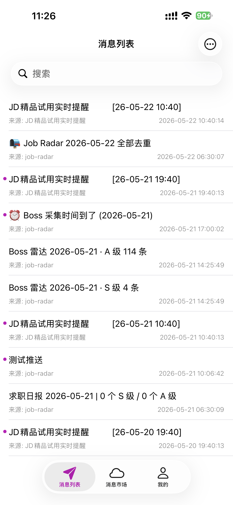</td>
<td>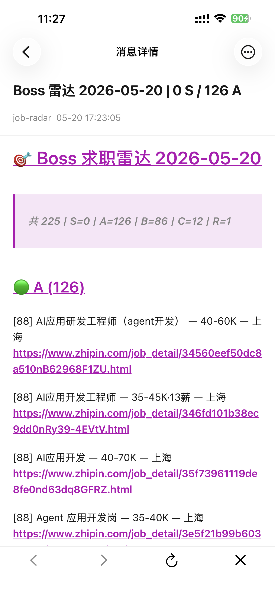</td>
<td>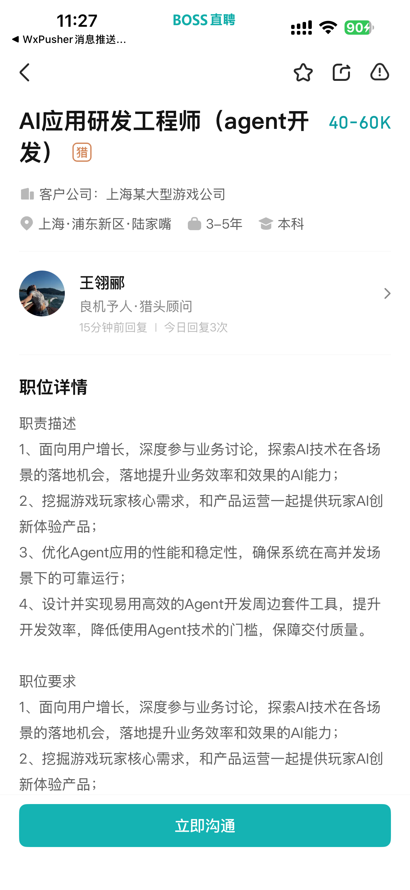</td>
</tr>
<tr>
<td align="center">① 微信收到累积清单</td>
<td align="center">② 点开看当天 A 级 126 条</td>
<td align="center">③ 点链接直接跳 Boss App 聊 HR</td>
</tr>
</table>

**完整闭环**:扩展跑分 → 微信推送 → 手机点链接 → Boss App → 找 HR 聊。**5 分钟把当天 A 级岗位全聊完。**

> 📖 完整配置教程(5 分钟,免费):**[docs/wxpusher-setup.md](docs/wxpusher-setup.md)**

不想用?直接画像 tab 里 WxPusher 两个框**留空**就行,所有结果都在数据池 / 看板 / CSV 里。

---

## 🔄 升级到最新版

之前 `git clone` 过的用户,3 步更新:

```bash
cd ~/job-radar          # 当年 clone 的目录
git pull                # 拉最新代码
```

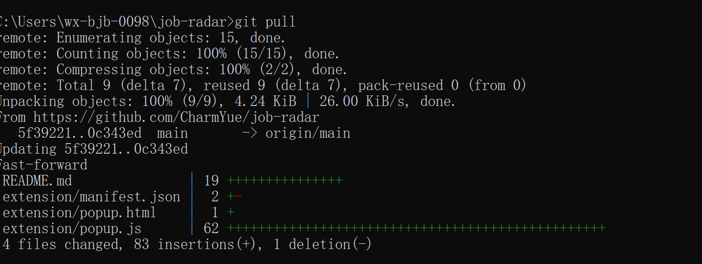

然后在 Chrome 里:

3. `chrome://extensions/` → 找到「Boss 求职雷达」卡片 → 点卡片右下角**🔄 刷新图标**(或者直接关 Chrome 再开)

确认版本:扩展卡片下方应该显示当前 `manifest.json` 里的版本号(比如 `6.3.0`)。你之前填的画像/AI key/搜索预设/数据池**都不会丢** — 数据全在 IndexedDB + chrome.storage,跟 git 代码独立。

> 想看每次更新做了什么:`git log --oneline -20` 看最近 20 条 commit。

---

## 📂 目录

```
extension/
  manifest.json           Chrome MV3 配置
  injected.js             主世界:monkey-patch fetch/XHR 观察 Boss 数据
  content.js              隔离世界:消息转发 + 滚动/点击操控
  background.js           SW 状态机:采集 → IndexedDB → 打分 → 推送
  popup.html / popup.js   主 UI (画像 / 搜索 / 运行 / 历史 4 tab)
  dashboard.html / dashboard.js   🖥 全屏看板(独立 tab)
  dict.json               Boss 职位/城市/行业三级 taxonomy
```

`scripts/` + `src/job_radar/` + `launchd/` 是早期 Python ATS 爬取的 pipeline(Greenhouse / Lever / Workday 直接调 API),独立于 Chrome 扩展。新用户只装扩展就够。

---

## 🛠 技术细节

- **MV3 状态机**:`runPipeline` 是 alarm 驱动的 state machine。每个采集任务 / 打分批次都是独立"单元",写完 IDB 用 `chrome.alarms` 调度下一步。SW 被 Chrome 杀掉照样从 storage 续跑。
- **数据层**:IndexedDB store `jobs` 主键 `job_id`,索引 `score_priority / crawl_time_ts / user_marked / company_name`。所有写都是单条 atomic,告别"全图读 → 改 → 写"的 race。
- **打分指纹**:`PROMPT_VERSION + provider + model + djb2(profile) + djb2(job content)`。改简历 / 换 model / 拿到 full_jd 自动触发重打,不变就直接跳过。
- **风控感知**:连续 3 次拿到 Boss `code=37` 自动冷却 30 分钟。

详见 [`docs/extension.md`](docs/extension.md)。

---

## 🎬 视频演示

**📺 完整流程录像(B 站)** — 安装 → 配画像 → 跑一轮 → 看结果 → 手机收推送 → 跟 HR 聊:

[](https://www.bilibili.com/video/BV15XLi6qECr/)

🔗 https://www.bilibili.com/video/BV15XLi6qECr/

---

## 🤝 贡献 / Issue

代码量 ~5000 行,主要在 `extension/background.js`(SW)+ `popup.js`(UI)+ `dashboard.js`(看板)。欢迎:

- 🐛 Bug 反馈(SW 续跑异常 / IDB 数据丢失 / 风控触发 / 打分明显跑偏)
- 🎨 新功能 PR(其他求职平台?其他 LLM?数据可视化?)
- 📝 文档改进

---

## ⚖️ 使用须知 / 法律声明

求职雷达是**给个人用户在自己电脑、自己登录的 Boss 账号上辅助筛选岗位**的工具,**不是爬虫,也不替你投递**。

**技术性质:**

- 仅在你自己的 Chrome 浏览器里运行,**不主动请求** Boss 任何接口
- 只观察 Boss 自己的 JS 已经发送到你浏览器的数据(等同于你手动浏览页面看到的内容,只是帮你按个人偏好重排)
- 数据存你本地 IndexedDB / chrome.storage,**不上传到任何第三方服务器**(包括我)
- LLM 打分用**你自己的 API key**,数据只在「你的 Chrome ↔ 你选的 LLM provider」之间流转
- 投递必须你自己在 Boss App / 网页上完成 — 工具不会、也不能自动投递

**你的责任:**

- 仅在自己账号上使用,**不批量化 / 不商业化 / 不转售数据**
- 遵守 [Boss 直聘用户协议](https://www.zhipin.com)(其中可能禁止使用第三方工具 — 这是**平台规则**,与法律是两回事;最坏情况是账号被风控,本扩展通过"只观察不发请求"的设计已经大幅降低这个风险)
- 投递时**人工核对岗位真实性**,不要 100% 依赖 AI 评分

**维护者免责** — 本项目 MIT 开源,按"AS IS"提供。维护者不对使用过程中产生的任何后果(账号问题 / 误投 / API 费用 / 法律纠纷)承担责任。

---

## License

MIT — 见 [LICENSE](LICENSE)。
