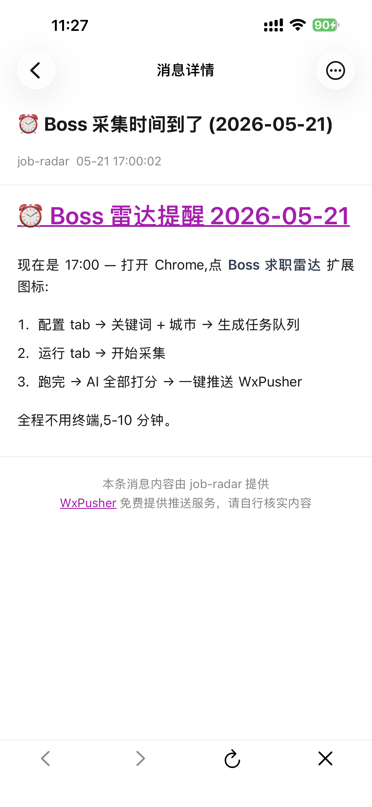
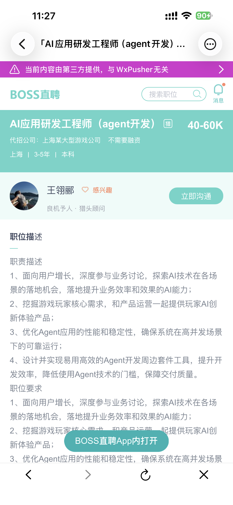

# 📱 WxPusher 配置教程(可选)

WxPusher 是一个**免费**的微信推送服务,跑完流水线后**自动把 S/A 级岗位 + 链接推到你的微信**。

## 不配会怎样?

完全不影响功能 — 你只是**收不到微信**,所有结果都在扩展的「数据池」+「🖥 全屏看板」+「CSV 导出」里看。

**适合 PC 党直接跳过**。下面是想要"上班路上手机刷岗位"的玩法。

---

## 它能带来什么(看图)

> ⚠️ 以下截图里如有真实公司名 / HR 姓名,均为 Boss 直聘原生显示。发布前如有顾虑请打码。

### 1️⃣ 微信推送消息列表

每次跑完流水线自动推一条,**S 级 + A 级分别一条**,看一眼累积统计:

### 2️⃣ 17:00 自动提醒(可选)

可以再配一个"下午 5 点提醒打开扩展"的固定推送,免得忘了跑:

### 3️⃣ 每日推送详情

点开就是 Markdown 渲染的当日所有 S/A 级岗位,**带分数 + 公司 + 薪资 + Boss 直接链接**:

### 4️⃣ 点链接直接打开 Boss App

每个岗位是 `https://www.zhipin.com/job_detail/...` 链接,微信里点击会**自动唤起 Boss App**显示岗位详情:

### 5️⃣ 直接和 HR 打招呼

Boss App 里可以**马上点"立即沟通"**,HR 活跃度状态都在(15 分钟前回复 / 今日活跃等):

**完整闭环**:扩展跑分 → 微信推送 → 手机点链接 → Boss App → 找 HR 聊。**上班路上 5 分钟把当天的 A 级岗位全聊完**。

---

## 配置步骤(5 分钟)

### 步骤 1:开通 WxPusher 应用

1. 浏览器打开 [wxpusher.zjiecode.com](https://wxpusher.zjiecode.com)
2. 右上角 **微信扫码登录**(用你自己的微信)
3. 进 **管理后台** → **应用管理** → **创建应用**
   - 应用名:任意,例如「Boss 求职雷达」
   - 应用图标:可以不传
   - 创建后得到一个 **AppToken**,形如 `AT_xxxxxxxxxxxxxxxxxxxx` — **复制下来,这是扩展画像 tab 里的 App Token**

### 步骤 2:获取你的 UID(关注应用)

1. 在 WxPusher 后台应用详情页找到 **"关注二维码"** 或 **"测试用户"**
2. 用微信扫这个二维码 → 关注公众号 **「微信推送 Plus」**(或类似名字)
3. 关注后会自动收到一条欢迎消息,里面带 **你的 UID**,形如 `UID_xxxxxxxxxxxxxxxxxxxx`
4. 或者:直接在 WxPusher 后台 **应用 → 关注用户** 列表里能看到自己的 UID

### 步骤 3:填到扩展里

打开 Boss 求职雷达 → 画像 tab → 滚到最下面 **📨 WxPusher** 卡片:

- **App Token**: 粘贴步骤 1 拿到的 `AT_...`
- **UID**: 粘贴步骤 2 拿到的 `UID_...`

填完点 **📨 测试推送** — 微信能立刻收到一条"✅ Boss 雷达推送测试"就是成功。

### 步骤 4:跑流水线

按正常流程跑 🚀 一轮,跑完会自动按以下规则推送:

- 有 S 级 → 单独发一条「S 级 N 条」(标题特别显眼)
- 有 A 级 → 单独发一条「A 级 N 条」
- 没 S/A 但有 B → 发一条「无 S/A · 仅 B 级 N 条」

每条都是完整 Markdown,**点击岗位标题旁的链接直接打开 Boss App**(微信会自动跳转,不需要复制粘贴 URL)。

---

## 常见问题

### ❓ 收不到推送?

按顺序排查:

1. **测试推送是否成功** — 画像 tab 点 📨 测试推送,如果失败看弹窗里的错误码
2. **检查 token / UID 是否填错** — `AT_` 和 `UID_` 这两个前缀必须有
3. **检查微信公众号"微信推送 Plus"是否被取消关注**(取消了 UID 就失效)
4. **微信免打扰** — 如果你给"微信推送 Plus"开了免打扰,消息还在但没声音

### ❓ 一次只推 S/A,B/C 怎么看?

B/C/Reject 不微信推 — 都在扩展数据池里。手机上看着已经够多了,大量推送会被微信折叠。

想要看完整数据:扩展 → 数据池 → 🖥 全屏看板 → 切到 B 档 filter,或者一键 📥 CSV 导 Excel。

### ❓ 一次推送被截断?

WxPusher 单条消息上限 10000 字符。扩展已经**自动按档位拆**(S 一条 + A 一条),正常不会触发截断。如果你某天 A 级超过 100 条还是被截断,后台可以联系 WxPusher 申请提升上限。

### ❓ 收费吗?

WxPusher **个人使用完全免费**。你只要不滥用(每天千条以下),不会限频。这个项目的使用强度(每天 1-2 次 × ≤200 条岗位)远低于他们的限额。

---

## 不想用 WxPusher?

完全可以,本扩展所有功能都不依赖它。三种替代方式:

1. **直接在 PC 上看** — 数据池卡片 / 表格 / 🖥 全屏看板,体验更好
2. **一键 CSV 导 Excel** — 在 Excel 里二次筛(我自己的 SOP:HR 今日活跃 + A 级以上)
3. **复制粘贴到 Notion / 飞书** — 把 CSV 导入,做个人岗位追踪库

把画像 tab 里的 App Token / UID **留空**就行,扩展会自动跳过推送阶段,流水线还是正常跑完。
